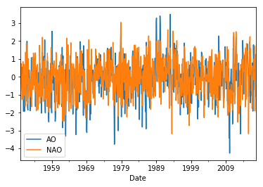
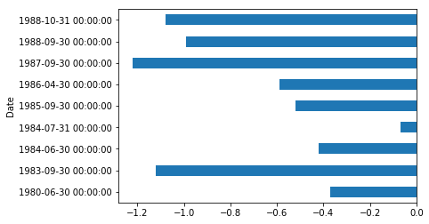

A Time Series is a set of data points collected at constant time intervals. These can be analyzed to determine the long term trend, 
so as to forecast the future, or perform some other form of analysis. But what makes a time series different from say a regular 
regression problem? 

There are 2 things:

1. It is time dependent. So the basic assumption of a linear regression model that the observations are independent doesn’t hold in this case.
2. Along with an increasing or decreasing trend, most time series have some form of seasonality trends, i.e. variations specific to a particular 
time frame. For example, if you see the sales of a woolen jacket over time, you will invariably find higher sales in winter seasons.

In this lesson, we'll look at some of the properties of a time series, by examining the the Arctic Oscillation (AO) and North Atlantic Oscillation (NAO) 
data sets


## Loading Data

We'll start by loading a time series of the Arctic Oscillation (AO) data set, which is contained in the `monthly.ao.index.b50.current.ascii` file. Each row
in the file contains three entries: year, month, and value. Here is the code to load the data set:

```python
ts = pd.read_table('monthly.ao.index.b50.current.ascii', header=None, sep='\s+', parse_dates=[[0,1]])
```

Other than the name of the file, we also have to tell Pandas that there is no header row using `header=None`. Next, we have to specify the type of delimiter, 
since the `read_table` method assumes a tab character. The string `'\s+'` tells it to use one or more spaces or tabs. We also have to specify that we want 
to use a combination of the first and second columns as the time series, which is done using the `parse_dates` argument.

The `ts` variable should now contain a `DataFrame` like the following:

```
           0_1         2
0   1950-01-01 -0.060310
1   1950-02-01  0.626810
2   1950-03-01 -0.008128
3   1950-04-01  0.555100
4   1950-05-01  0.071577
5   1950-06-01  0.538570
6   1950-07-01 -0.802480
7   1950-08-01 -0.851010
8   1950-09-01  0.357970
9   1950-10-01 -0.378900
10  1950-11-01 -0.515110
...
```

To make the data set even more useful, we really want the index for the `DataFrame` to be the time series rather than have it stored as a column. Also, notice that the 
time series starts at the beginning of each month. Since the data actually represents the AO for the whole month, we want these dates to be the end of the month instead.
We can also give the index and column a name rather than just a number. To fix up the `DataFrame` use the following few statements:

```python
ts.set_index('0_1', inplace=True) # make the '0_1' column into an index
ts.index = ts.index.to_period().to_timestamp('M') # convert dates to end of month
ts.index.name = 'Date' # Give the index a name
ts.columns = ['AO'] 
print(ts)
```

Now the `DataFrame` looks like this, which is much better:

```
                  AO
Date                
1950-01-31 -0.060310
1950-02-28  0.626810
1950-03-31 -0.008128
1950-04-30  0.555100
1950-05-31  0.071577
1950-06-30  0.538570
1950-07-31 -0.802480
1950-08-31 -0.851010
1950-09-30  0.357970
1950-10-31 -0.378900
1950-11-30 -0.515110
...
```

Let's try some different plots of the data:

```python
ts.plot()
plt.show() # may need this to show the plot
```


Zoom in on a 10-year range:

```python
ts['1980':'1990'].plot()
```


Or part of a year:

```python
ts['1980-05':'1981-03'].plot()
```


Notice that it is possible to use a partial date to index the data. For example we can look up a single month
using:

```python
print(ts['1960-01'])
```

```
                AO
Date              
1960-01-31 -2.4842
```

Or a single year using:

```python
print(ts['1960'])
```

```
                  AO
Date                
1960-01-31 -2.484200
1960-02-29 -2.212400
1960-03-31 -1.624600
1960-04-30 -0.297310
1960-05-31 -0.857430
1960-06-30  0.054978
1960-07-31 -0.619060
1960-08-31 -1.007900
1960-09-30 -0.381640
1960-10-31 -1.187000
1960-11-30 -0.553230
1960-12-31 -0.342950
```

Passing only a portion of a date is known as *partial string* indexing.

> ## Challenge
>
> Other forms of indexing work too. What do you think the following statement
> would display?
>
> ```python
> ts[ts.AO > 0]
> ```
{: .challenge}

Let's now make it a bit more interesting and add another data set. This time we'll load the NOA data set and add
it to the original one.

```python
nao = pd.read_table('norm.nao.monthly.b5001.current.ascii', header=None, sep='\s+', parse_dates=[[0,1]])
nao.set_index('0_1', inplace=True)
nao.index = nao.index.to_period().to_timestamp('M')
ts['NAO'] = nao
print(ts)
```

```
                  AO       NAO
Date                          
1950-01-31 -0.060310  0.920000
1950-02-28  0.626810  0.400000
1950-03-31 -0.008128 -0.360000
1950-04-30  0.555100  0.730000
1950-05-31  0.071577 -0.590000
1950-06-30  0.538570 -0.060000
1950-07-31 -0.802480 -1.260000
1950-08-31 -0.851010 -0.050000
1950-09-30  0.357970  0.250000
1950-10-31 -0.378900  0.850000
1950-11-30 -0.515110 -1.260000
...
```

Let's plot it:

```python
ts.plot()
```



What if we wanted to plot all NAO values in the 1980s for months where AO is positive and NAO is negative, and then plot them?

```python
import datetime
ts.loc[(ts.AO > 0) & (ts.NAO < 0) 
        & (ts.index > datetime.datetime(1980,1,1)) 
        & (ts.index < datetime.datetime(1989,1,1)),
        'NAO'].plot(kind='barh')
```



## Statistics

## Resampling

## Moving Statistics
