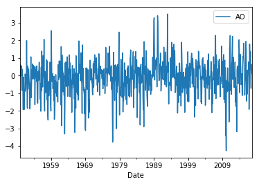
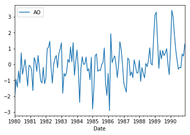
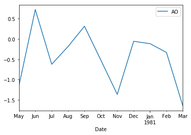

Time Series is a collection of data points collected at constant time intervals. These are analyzed to determine the long term trend 
so as to forecast the future or perform some other form of analysis. But what makes a time series different from say a regular 
regression problem? 

There are 2 things:

1. It is time dependent. So the basic assumption of a linear regression model that the observations are independent doesn’t hold in this case.
2. Along with an increasing or decreasing trend, most time series have some form of seasonality trends, i.e. variations specific to a particular 
time frame. For example, if you see the sales of a woolen jacket over time, you will invariably find higher sales in winter seasons.

In this lesson, we'll look at some of the properties of a time series, by examining the the Arctic Oscillation (AO) and North Atlantic Oscillation (NAO) 
data sets


## Loading Data

We'll start by loading a time series of the Arctic Oscillation (AO) data set, which is contained in the `monthly.ao.index.b50.current.ascii` file. Each row
in the file contains three entries: year, month, and value. Here is the code to load the data set:

```python
AO = pd.read_table('monthly.ao.index.b50.current.ascii', header=None, sep='\s+', parse_dates=[[0,1]], names=['Date', 'Value'])
```

We first tell Pandas that there is no header row (`header=None`). Next, we have to specify the type of delimiter, since it assumes a tab character. The 
string `'\s+'` tells it to use one or more spaces or tabs. We also have to specify that we want to use a combination of the first and second columns
as the time series, which is done using the `parse_dates` argument.

The `AO` variable should now be a `DataFrame` containing the following:

```
	0_1	2
0	1950-01-01	-0.060310
1	1950-02-01	0.626810
2	1950-03-01	-0.008128
3	1950-04-01	0.555100
4	1950-05-01	0.071577
5	1950-06-01	0.538570
6	1950-07-01	-0.802480
7	1950-08-01	-0.851010
8	1950-09-01	0.357970
9	1950-10-01	-0.378900
10	1950-11-01	-0.515110
...
```

However, to make the data set more useful, we really want the index for the `DataFrame` to be the dates rather than stored as a column. Also, notice that the dates
all start at the beginning of the month. Since the data actually represents the AO for the whole month, we want these dates to be the end of the month instead.
We can also give the column a name rather than just a number. We can fix up the `DataFrame` with a few statements as follows:

```python
AO.set_index('0_1', inplace=True) # make the '0_1' column into an index
AO.index = AO.index.to_period().to_timestamp('M') # convert dates to end of month
AO.index.name = 'Date' # Give the index a name
AO.columns = ['AO'] 
```

Now the `DataFrame` looks like this, which is much better:

```
	AO
Date	
1950-01-31	-0.060310
1950-02-28	0.626810
1950-03-31	-0.008128
1950-04-30	0.555100
1950-05-31	0.071577
1950-06-30	0.538570
1950-07-31	-0.802480
1950-08-31	-0.851010
1950-09-30	0.357970
1950-10-31	-0.378900
1950-11-30	-0.515110
...
```

Let's try some different plots of the data:

```python
AO.plot()
plt.show() # may need this to show the plot
```

We should see the following:



Zoom in on a 10-year range:

```python
AO['1980':'1990'].plot()
plt.show() # may need this to show the plot
```

This will result in:



Or part of a year:

```python
AO['1980-05':'1981-03'].plot()
plt.show() # may need this to show the plot
```

We should see the following:




